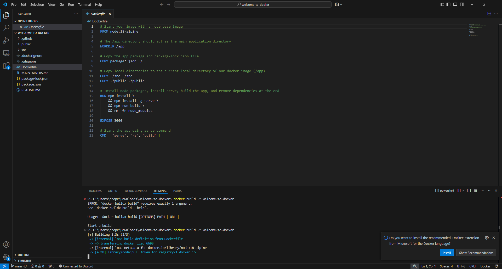
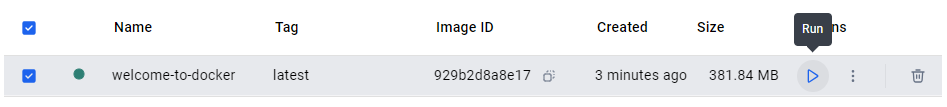
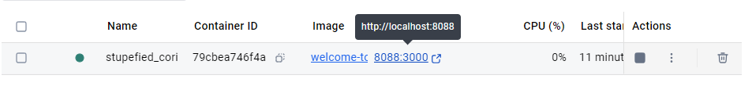
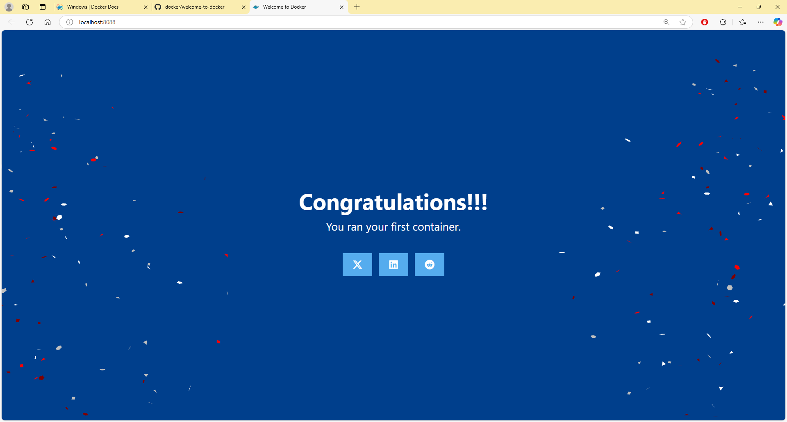

## How to get started?

1. To get started, you first need to download and install Docker at https://docs.docker.com/
2. Once installed, you should have the desktop application GUI for Docker. Open it up to see and explore the UI. We’ll explore the UI later on after we create our first container and image file.
3. Now, we will use a template project to make this process easier. you would need to do this manually later on, on your personal project.
    1. Open your terminal(i.e. CMD) then type the command `git clone https://github.com/docker/welcome-to-docker`
    2. Open the folder on an IDE of your choice, use the Command Line Interface(CLI) and type `docker build -t welcome-to-docker .` **note**: -t flag allows you to specify the name you’re giving to the image, then the `.` specifies the **build context.** The build context is the directory (and its subdirectories) that Docker will use to find the DockerFile and any other files needed to build the image.
        
        
        
    3. After the build is done, go back to Docker Desktop application and on the side, navigate to `Images` ta, you will see a new Image is created with the name *“welcome-to-docker”* , on the **action** tab, you will see a run icon, click that to run the image.
        1. **note**: after clicking run, there will be a popup called optional options, click that and you can specify the port that you want to host the app, for example: port `8088` . You can also specify the name of the container the image file will be hosted if you wish so. Click **run** after setting up the optional fields.
        
        
        
    4. Navigate to Containers tab, you will see an overview of the containers that you have, running the image resulted in a new container being created. This container would also be running the first time you created it via running the image file, so you can just view the application by clicking the link on the `Port` 
        
        
        
    5. That’s it, you’ve successfully ran your first docker container! If you’ve done everything correctly and viewed your application, you should have something like this.
        
        
